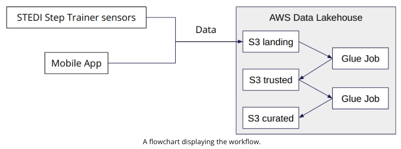
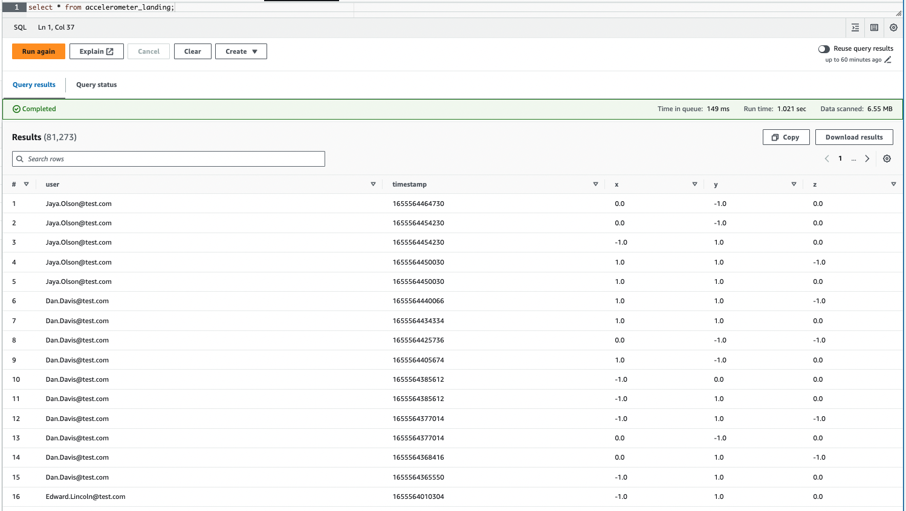

# STEDI Human Balance Analytics: Engineering a Data Lakehouse

## Project Introduction

This project involves creating a data lakehouse solution for the STEDI team, leveraging sensor data to train a machine learning model. 
The core device is the **STEDI Step Trainer**, a hardware that helps users with balance exercises while collecting valuable data for machine learning purposes.

## Project Details

The STEDI Step Trainer, paired with a mobile app, serves dual purposes:

- **Training**: Assists users in balance exercises.
- **Data Collection**: Gathers step data through sensors for a machine learning algorithm.

A significant number of early adopters are already using the Step Trainer and mobile app, providing a rich dataset for analysis.

- The Step Trainer uses motion sensors to record distances of the object detected. 
- The mobile app uses a phone's accelerometer to detect motion in the X, Y, and Z directions. 
- Data privacy is paramount. Only data from customers who have consented for research should be utilized for the machine learning model.

### Main tasks
- Extract data from both the Step Trainer sensors and mobile app.
- Curate the data into an AWS-based data lakehouse.
- Enable Data Scientists to train a machine learning model.
- Anonymize the final curated table so that it is not subject to GDPR or other privacy regulations.

### Project Environment

The lakehouse solution is developed using:

- Python and Spark for processing.
- AWS Glue for data integration.
- AWS Athena for interactive querying.
- AWS S3 for data storage.

### Project Data

STEDI provides [three JSON data sources](https://github.com/udacity/nd027-Data-Engineering-Data-Lakes-AWS-Exercises/tree/main/project/starter):

- `customer` data from fulfillment and the STEDI website
- `step_trainer` records from the motion sensor
- `accelerometer` data from the mobile app

### Project Workflow

## Implementation

### Landing Zone

#### 1. Ingested data from the data source repository into a landing zone S3 bucket using AWS CloudShell.

#### 2. Created Glue tables (SQL DDL scripts):
* [customer_landing.sql](./customer_landing.sql)
* [accelerometer_landing.sql](./accelerometer_landing.sql)
* [step_trainer_landing.sql](./step_trainer_landing.sql)

#### 3. Used Athena to query data in the Landing Zone.

* `customer_landing` table:

The `customer_landing` data contains multiple rows with a blank `shareWithResearchAsOfDate`.

* `accelerometer_landing` table:

* `step_trainer_landing` table:

* record count check for each table:

### Trusted Zone

#### 1. Used Glue Studio to ingest data from an S3 bucket. Glue Jobs created:
* [customer_landing_to_trusted.py](./customer_landing_to_trusted.py) has a node that drops rows that do not have data in the `sharedWithResearchAsOfDate` column.
* [accelerometer_landing.py](./accelerometer_landing_to_trusted.py) has a node that inner joins the `customer_trusted` data with the `accelerometer_landing` data by emails.
* [step_trainer_landing.py](./step_trainer_trusted.py) has a node that inner joins the `step_trainer_landing` data with the `customer_curated` data by serial numbers.

#### 2. Created Glue tables:
* `customer_trusted`
* `accelerometer_trusted`
* `step_trainer_trusted`

#### 3. Used Athena to query data in the Trusted Zone

* record count check for each table:

* `customer_trusted` data has no rows where shareWithResearchAsOfDate is blank:

### Curated Zone

#### 1. Used Glue Studio to ingest data from an S3 bucket. Glue Jobs created:
* [customer_trusted_to_curated.py](./customer_trusted_to_curated.py) as a node that inner joins the `customer_trusted` data with the `accelerometer_trusted` data by emails.
* [machine_learning_curated.py](./machine_learning_curated.py) has a node that inner joins the `step_trainer_trusted` data with the `accelerometer_trusted` data by sensor reading time and timestamps.

#### 2. Created Glue tables:
* `customer_curated`
* `machine_learning_curated`

#### 3. Used Athena to query data in the Curated Zone

* record count check for each table:

* The final table `machine_learning_curated` sanitized from PII data:
